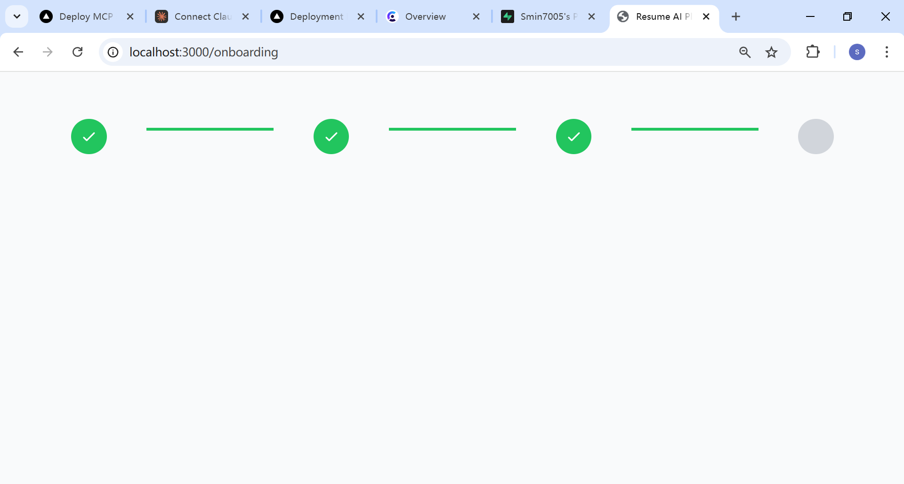
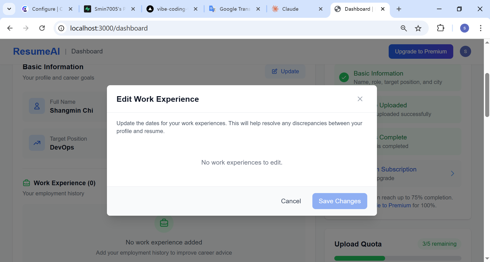

# Conversation - January 9, 2026

---

## Prompt 1

**User:** " I am making the deployment of Vercel, and this is the error report:
'Failed to compile.
./app/onboarding/page.tsx
258:20 Error: `'` can be escaped with `&apos;`, `&lsquo;`, `&#39;`, `&rsquo;`. react/no-unescaped-entities
./components/onboarding/AnalysisResults.tsx
103:13 Error: `'` can be escaped with `&apos;`, `&lsquo;`, `&#39;`, `&rsquo;`. react/no-unescaped-entities
info - Need to disable some ESLint rules? Learn more here: https://nextjs.org/docs/basic-features/eslint#disabling-rules
Error: Command "npm run build" exited with 1' how to fix it"

**Assistant Reply:**

- I'll fix these ESLint errors. The issue is unescaped apostrophes in JSX text. Let me read both files and fix them.
  Fixed both files. The apostrophes are now properly escaped with &apos;. Let me verify the build passes locally.

### Follow-Up

**User:** "No I was doing this at the Vercel Dashboard online, so far we don't need to do it locally. This repository is directly imported to Vercel, now I will commit and push on Github and try it again."

**Assistant Reply:**

- Got it. The fixes are ready. When you commit and push to GitHub, Vercel will automatically redeploy with the corrected files. The changes I made:

        1. app/onboarding/page.tsx:258 - Changed You've to You&apos;ve
        2. components/onboarding/AnalysisResults.tsx:103 - Changed We've to We&apos;ve

Would you like me to commit and push these changes for you?

**User:** "I think now it requires supabase key, but we stored it locally, here is the error message:
'Linting and checking validity of types ...
Collecting page data ...
Error: supabaseUrl is required.
at /vercel/path0/.next/server/chunks/572.js:37:47050
at new rk (/vercel/path0/.next/server/chunks/572.js:37:47301)
at rS (/vercel/path0/.next/server/chunks/572.js:37:50967)
at 22797 (/vercel/path0/.next/server/app/api/onboarding/progress/route.js:1:1026)
at t (/vercel/path0/.next/server/webpack-runtime.js:1:128)
at t (/vercel/path0/.next/server/app/api/onboarding/progress/route.js:1:4182)
at /vercel/path0/.next/server/app/api/onboarding/progress/route.js:1:4217
at t.X (/vercel/path0/.next/server/webpack-runtime.js:1:1206)
at /vercel/path0/.next/server/app/api/onboarding/progress/route.js:1:4195
at Object.<anonymous> (/vercel/path0/.next/server/app/api/onboarding/progress/route.js:1:4245) > Build error occurred
Error: Failed to collect page data for /api/onboarding/progress
at /vercel/path0/node_modules/next/dist/build/utils.js:1269:15
at process.processTicksAndRejections (node:internal/process/task_queues:103:5) {
type: 'Error'
}
Error: Command "npm run build" exited with 1'
Since I'm test the deployment of Vercel, should we upload the Supabase key to Github? what would be the usual solutions?"

**Assistant Reply**

- Never upload secrets to GitHub. The standard solution is to add environment variables
  directly in the Vercel dashboard.

          How to add environment variables in Vercel:

          1. Go to your Vercel Dashboard → Select your project
          2. Click Settings tab
          3. Click Environment Variables in the left sidebar
          4. Add each variable from your .env.local file:
          ┌────────────────────────────────────┬────────────────────────────────┐
          │           Variable Name            │             Value              │
          ├────────────────────────────────────┼────────────────────────────────┤
          │ NEXT_PUBLIC_SUPABASE_URL           │ Your Supabase URL              │
          ├────────────────────────────────────┼────────────────────────────────┤
          │ NEXT_PUBLIC_SUPABASE_ANON_KEY      │ Your Supabase anon key         │
          ├────────────────────────────────────┼────────────────────────────────┤
          │ SUPABASE_SERVICE_ROLE_KEY          │ Your Supabase service role key │
          ├────────────────────────────────────┼────────────────────────────────┤
          │ NEXT_PUBLIC_CLERK_PUBLISHABLE_KEY  │ Your Clerk publishable key     │
          ├────────────────────────────────────┼────────────────────────────────┤
          │ CLERK_SECRET_KEY                   │ Your Clerk secret key          │
          ├────────────────────────────────────┼────────────────────────────────┤
          │ CLERK_WEBHOOK_SECRET               │ Your Clerk webhook secret      │
          ├────────────────────────────────────┼────────────────────────────────┤
          │ ANTHROPIC_API_KEY                  │ Your Anthropic API key         │
          ├────────────────────────────────────┼────────────────────────────────┤
          │ STRIPE_SECRET_KEY                  │ Your Stripe secret key         │
          ├────────────────────────────────────┼────────────────────────────────┤
          │ STRIPE_WEBHOOK_SECRET              │ Your Stripe webhook secret     │
          ├────────────────────────────────────┼────────────────────────────────┤
          │ NEXT_PUBLIC_STRIPE_PUBLISHABLE_KEY │ Your Stripe publishable key    │
          ├────────────────────────────────────┼────────────────────────────────┤
          │ NEXT_PUBLIC_APP_URL                │ Your Vercel deployment URL     │
          └────────────────────────────────────┴────────────────────────────────┘
          5. For each variable, select which environments it applies to (Production, Preview, Development)
          6. Click Save
          7. Redeploy your project (or push a new commit)

  This keeps your secrets secure - they're stored in Vercel's encrypted environment, not in your Git repository

## Prompt 2

**User:** "Now we can start the Stage 3 implementation. Do not forget to check the SPEC documents."

**Assistant Reply**

- Ready to code?

         Here is Claude's plan:
         ╌╌╌╌╌╌╌╌╌╌╌╌╌╌╌╌╌╌╌╌╌╌╌╌╌╌╌╌╌╌╌╌╌╌╌╌╌╌╌╌╌╌╌╌╌╌╌╌╌╌╌╌╌╌╌╌╌╌╌╌╌╌╌╌╌╌╌╌╌╌╌╌╌╌╌╌╌╌╌╌╌╌╌╌╌╌╌╌ Stage 3: Resume Management - Implementation Plan

         Overview

         Implement Claude API integration for AI-powered resume analysis, upload quota system,
         and analysis results storage.

         ---
         Files to Create

         1. lib/claude.ts - Claude API Client

         Purpose: Initialize Anthropic SDK and provide resume analysis functions.

         // Key exports:
         export interface ResumeAnalysisResult {
         basicInfo: { name, email, phone, address };
         skills: string[];
         experiences: ExtractedExperience[];
         grammarCorrections: string;
         careerAdvice: string[];
         improvementSuggestions: string;
         }

         export async function analyzeResume(
         resumeText: string,
         userType: 'free' | 'member',
         manualExperiences?: WorkExperience[]
         ): Promise<ResumeAnalysisResult>

         export function detectDateDiscrepancies(
         extractedExperiences: ExtractedExperience[],
         manualExperiences: WorkExperience[]
         ): DateDiscrepancy[]

         Claude Prompt Strategy:
         - Request structured JSON response
         - Extract: basic info, skills array, work experiences with dates
         - Generate career advice: 3-5 points (Free) or 10+ points (Member)
         - 60-second timeout, 2 retries for transient errors

         ---
         2. lib/quota.ts - Upload Quota Helpers

         Purpose: Track and enforce monthly upload limits.

         // Key exports:
         export async function checkUploadQuota(userId: string): Promise<{
         remaining: number;
         used: number;
         limit: number;
         canUpload: boolean;
         resetDate: string;
         }>

         export async function incrementUploadQuota(userId: string): Promise<void>
         export async function getOrCreateQuotaRecord(userId: string): Promise<UploadQuota>

         Business Rules:
         - Free users: 4 uploads/month max
         - Members: unlimited (canUpload: true always)
         - Failed uploads don't count
         - Quota resets on 1st of month at 00:00 UTC

         ---
         3. lib/resume-parser.ts - PDF Text Extraction

         Purpose: Extract text from uploaded PDF for Claude analysis.

         // Key exports:
         export async function extractTextFromResume(filePath: string): Promise<string>
         export function validateExtractedText(text: string): { isValid: boolean; error?:
         string }

         Dependency: npm install pdf-parse

         ---
         4. app/api/resume/analyze/route.ts - Analysis Endpoint

         Endpoint: POST /api/resume/analyze

         Request:
         { "resume_id": "uuid" }

         Response:
         {
         "success": true,
         "analysis": {
             "id": "uuid",
             "basic_info": {...},
             "skills": [...],
             "experiences": [...],
             "career_advice": "...",
             "improvement_suggestions": "...",
             "date_discrepancies": [...] | null
         }
         }

         Flow:
         1. Authenticate user (Clerk)
         2. Fetch resume record, verify ownership
         3. Download PDF from Supabase Storage
         4. Extract text using pdf-parse
         5. Get user's manual work experiences from database
         6. Call Claude API with resume text + user_type
         7. Compare extracted dates with manual entries (flag >1 month diff)
         8. Store analysis in resume_analyses table
         9. Return results

         ---
         5. app/api/quota/check/route.ts - Check Quota Endpoint

         Endpoint: GET /api/quota/check

         Response:
         {
         "remaining": 3,
         "used": 1,
         "limit": 4,
         "canUpload": true,
         "resetDate": "2026-02-01T00:00:00Z"
         }

         ---
         6. app/api/quota/increment/route.ts - Increment Quota (Internal)

         Endpoint: POST /api/quota/increment

         Called internally after successful upload.

         ---
         Files to Modify

         7. app/api/resume/upload/route.ts - Add Quota Check

         Add after line ~51 (after getting user profile):
         // Check quota for free users before upload
         if (userProfile.user_type === 'free') {
         const quota = await checkUploadQuota(userProfile.id);
         if (!quota.canUpload) {
             return NextResponse.json(
             { error: 'Upload quota exceeded. Upgrade to Premium for unlimited uploads.' },
             { status: 403 }
             );
         }
         }

         Add after line ~99 (after successful DB insert):
         // Increment quota after successful upload
         if (userProfile.user_type === 'free') {
         await incrementUploadQuota(userProfile.id);
         }

         ---
         8. components/onboarding/AnalysisResults.tsx - Real API Integration

         Replace mock fetchAnalysis (lines 24-66) with:
         const fetchAnalysis = async () => {
         try {
             setLoading(true);
             const response = await fetch('/api/resume/analyze', {
             method: 'POST',
             headers: { 'Content-Type': 'application/json' },
             body: JSON.stringify({ resume_id: resumeId }),
             });

             if (!response.ok) {
             const error = await response.json();
             throw new Error(error.error || 'Analysis failed');
             }

             const { analysis } = await response.json();
             setAnalysisData(analysis);
         } catch (err) {
             setError(err.message);
         } finally {
             setLoading(false);
         }
         };

         Add new UI sections:
         - Date discrepancy warnings (yellow alert box)
         - "Edit Work Experience" button when discrepancies exist
         - Career advice bullet points (tiered by user type)

         ---
         Implementation Order
         ┌──────┬───────────────────────────────────────────┬─────────────────────────────────┐
         │ Step │                   File                    │             Action              │
         ├──────┼───────────────────────────────────────────┼─────────────────────────────────┤
         │ 1    │ lib/claude.ts                             │ Create Claude API client        │
         ├──────┼───────────────────────────────────────────┼─────────────────────────────────┤
         │ 2    │ lib/quota.ts                              │ Create quota helper functions   │
         ├──────┼───────────────────────────────────────────┼─────────────────────────────────┤
         │ 3    │ lib/resume-parser.ts                      │ Create PDF text extraction      │
         ├──────┼───────────────────────────────────────────┼─────────────────────────────────┤
         │ 4    │ app/api/resume/analyze/route.ts           │ Create analysis endpoint        │
         ├──────┼───────────────────────────────────────────┼─────────────────────────────────┤
         │ 5    │ app/api/quota/check/route.ts              │ Create quota check endpoint     │
         ├──────┼───────────────────────────────────────────┼─────────────────────────────────┤
         │ 6    │ app/api/quota/increment/route.ts          │ Create quota increment endpoint │
         ├──────┼───────────────────────────────────────────┼─────────────────────────────────┤
         │ 7    │ app/api/resume/upload/route.ts            │ Add quota check before upload   │
         ├──────┼───────────────────────────────────────────┼─────────────────────────────────┤
         │ 8    │ components/onboarding/AnalysisResults.tsx │ Replace mock with real API      │
         └──────┴───────────────────────────────────────────┴─────────────────────────────────┘
         ---
         Error Handling
         ┌───────────────────────┬────────┬─────────────────────────────────────────────────┐
         │         Error         │ Status │                  User Message                   │
         ├───────────────────────┼────────┼─────────────────────────────────────────────────┤
         │ Unauthorized          │ 401    │ "Please sign in to continue"                    │
         ├───────────────────────┼────────┼─────────────────────────────────────────────────┤
         │ Resume not found      │ 404    │ "Resume not found"                              │
         ├───────────────────────┼────────┼─────────────────────────────────────────────────┤
         │ Quota exceeded        │ 403    │ "Upload quota exceeded. Upgrade to Premium."    │
         ├───────────────────────┼────────┼─────────────────────────────────────────────────┤
         │ Claude timeout        │ 408    │ "Analysis took too long. Please try again."     │
         ├───────────────────────┼────────┼─────────────────────────────────────────────────┤
         │ Claude rate limit     │ 429    │ "Too many requests. Please wait."               │
         ├───────────────────────┼────────┼─────────────────────────────────────────────────┤
         │ PDF extraction failed │ 422    │ "Could not read resume. Please check the file." │
         └───────────────────────┴────────┴─────────────────────────────────────────────────┘
         ---
         Verification Checklist

         Functional Tests

         - Claude API successfully called and returns analysis
         - Basic info extracted with >90% accuracy (test 20 resumes)
         - Skills extracted with >85% accuracy
         - Work experiences with dates extracted with >80% accuracy
         - Date discrepancies detected correctly (>1 month diff)
         - Career advice generated (3-5 for Free, 10+ for Member)
         - Analysis completes within 60 seconds
         - Analysis results stored in database

         Quota Tests

         - Upload quota tracked correctly for free users
         - Free users blocked after 4 uploads with upgrade prompt
         - Members have unlimited uploads (no quota check)
         - Failed uploads don't count toward quota
         - Quota indicator shows "X/4 uploads remaining"

         Storage Tests

         - Free user: new upload replaces previous resume
         - Member: new upload creates new version
         - Analysis linked to correct resume_id

         End-to-End

         - Complete flow: Upload -> Analysis -> Display results
         - Date discrepancy warning appears when dates differ
         - "Edit Work Experience" button works for corrections

         ---
         Dependencies

         npm install pdf-parse
         # @anthropic-ai/sdk already installed

  Do you want me to proceed?

### Follow-Up

**User:** "I think for now we don't need to build the project, because we didn't finish stage 4,5,and 6 yet, so perhaps we just finish the stage 3 implementation, then we do stage 3 test, what do u think? "

**Assistant Reply:**

- Good point. Let me summarize Stage 3 implementation status and propose testing.

          Stage 3 Implementation Complete

          Files Created:
          1. lib/claude.ts - Claude API client with resume analysis
          2. lib/quota.ts - Upload quota tracking and enforcement
          3. lib/resume-parser.ts - PDF text extraction
          4. app/api/resume/analyze/route.ts - Analysis endpoint
          5. app/api/quota/check/route.ts - Check quota endpoint
          6. app/api/quota/increment/route.ts - Increment quota endpoint

          Files Modified:
          7. app/api/resume/upload/route.ts - Added quota check before upload
          8. components/onboarding/AnalysisResults.tsx - Real API integration

          Stage 3 Testing Approach

          To test Stage 3, you can:

          1. Run the dev server locally: npm run dev
          2. Test the onboarding flow:
              - Sign up as a new user
              - Fill in basic info + work experience
              - Upload a PDF resume
              - Verify Claude API analyzes it and displays results
          3. Test quota enforcement:
              - Upload 4 resumes as a free user
              - Verify 5th upload is blocked
          4. Test the API endpoints directly using a tool like Postman or curl

  Would you like me to:

  1. Start the dev server and guide you through manual testing?
  2. Create a simple test script to verify the API endpoints?
  3. Something else?

**User:** "2"

**Assistant Reply:**

- Test Scripts Created

        I've created two testing resources:

        1. API Test Script

        File: scripts/test-stage3.ts

        Run it with:
        npm run dev  # First, start the dev server
        npx ts-node scripts/test-stage3.ts  # In another terminal

        This script tests that all Stage 3 endpoints are reachable and properly protected with authentication.

        2. Manual Testing Guide

        File: scripts/STAGE3_TESTING_GUIDE.md

        A comprehensive guide covering:
        - Full onboarding flow with resume analysis
        - Quota check testing
        - Upload quota enforcement (4/month limit)
        - Resume analysis API testing
        - Date discrepancy detection
        - Member vs Free user career advice
        - Troubleshooting tips
        - Database verification steps

        ---
        To Start Testing

        1. Start the dev server:
        npm run dev
        2. Run the API test script:
        npx ts-node scripts/test-stage3.ts
        3. Follow the manual testing guide in scripts/STAGE3_TESTING_GUIDE.md

  Would you like me to start the dev server and begin testing?

**User:** "I have run the project on localhost 3000, how to test by these 2 scripts?"

**Assistant Reply:**

- Great! Let's run the API test script first.

        ● Bash(cd "C:\6Internship\VibeCodingTest" && npx ts-node                    timeout: 1m
            scripts/test-stage3.ts 2>&1)                                          0s
        ⎿ npm warn exec The following package was not found and will be installed:
            ts-nod
            e@10.9.2
            … +49 lines (ctrl+o to expand)

        ● All 5 API tests passed! The endpoints are properly secured - they return 401 (Unauthorized) for unauthenticated requests.

        Next: Manual Browser Testing

        Now test with authentication through the browser:

        Quick Test Steps:

        1. Open http://localhost:3000 in your browser
        2. Sign up or sign in with a test account
        3. Go through onboarding:
            - Fill in basic info + work experience (Step 2)
            - Upload a PDF resume (Step 3)
            - Watch the AI analysis run (Step 4)

        Test API in Browser Console:

        After signing in, open browser DevTools (F12) → Console tab, and run:

        // Test 1: Check your quota
        fetch('/api/quota/check')
            .then(r => r.json())
            .then(data => console.log('Quota:', data))

        // Test 2: Check analysis (need a resume_id from upload)
        // Replace 'YOUR_RESUME_ID' with actual ID from upload response
        fetch('/api/resume/analyze', {
            method: 'POST',
            headers: { 'Content-Type': 'application/json' },
            body: JSON.stringify({ resume_id: 'YOUR_RESUME_ID' })
        })
        .then(r => r.json())
        .then(data => console.log('Analysis:', data))

  Would you like me to walk you through the full onboarding test flow?

**User:** "A error occurred during pdf analysing at step 4
📝 Extracting text from PDF (901012 bytes)...
❌ Error extracting PDF text: TypeError: Object.defineProperty called on non-object
at Function.defineProperty (<anonymous>)
at **webpack_require**.r (C:\6Internship\VibeCodingTest\.next\server\webpack-runtime.js:146:21)
at eval (webpack-internal:///(rsc)/./node_modules/pdf-parse/node_modules/pdfjs-dist/legacy/build/pdf.mjs:1:21)
at (rsc)/./node_modules/pdf-parse/node_modules/pdfjs-dist/legacy/build/pdf.mjs (C:\6Internship\VibeCodingTest\.next\server\vendor-chunks\pdf-parse.js:200:1)
at **webpack_require** (C:\6Internship\VibeCodingTest\.next\server\webpack-runtime.js:33:42)
at eval (webpack-internal:///(rsc)/./node_modules/pdf-parse/dist/pdf-parse/esm/PDFParse.js:5:89)
at (rsc)/./node_modules/pdf-parse/dist/pdf-parse/esm/PDFParse.js (C:\6Internship\VibeCodingTest\.next\server\vendor-chunks\pdf-parse.js:50:1)
at **webpack_require** (C:\6Internship\VibeCodingTest\.next\server\webpack-runtime.js:33:42)
at eval (webpack-internal:///(rsc)/./node_modules/pdf-parse/dist/pdf-parse/esm/index.js:20:70)
at (rsc)/./node_modules/pdf-parse/dist/pdf-parse/esm/index.js (C:\6Internship\VibeCodingTest\.next\server\vendor-chunks\pdf-parse.js:190:1)
at Function.**webpack_require** (C:\6Internship\VibeCodingTest\.next\server\webpack-runtime.js:33:42)
at process.processTicksAndRejections (node:internal/process/task_queues:105:5)"

**Assistant Reply:**

- The pdf-parse library has compatibility issues with Next.js's webpack bundling. Let me fix this by using a different approach.
  Now let me update the resume-parser to use the older version properly

  1.  Stop the current server (Ctrl+C in the terminal running npm run dev)
  2.  Start it again: npm run dev
  3.  Try the onboarding flow again - upload your PDF resume at Step 3
      The fix uses the older pdf-parse@1.1.1 version which is more compatible with Next.js.

  Let me know if you encounter any other errors.

**User:** "There is a bug at uploading resume."

**Assistant Reply:**

- I found the issue!
  The page is at Step 4 but resumeId is null (lost when you refreshed). The AnalysisResults component only shows when currentStep === 4 && resumeId.
  Let me fix this by fetching the current resume when the user returns to Step 4.
  Now let me update the onboarding page to fetch the current resume when needed.
  Now let me also add a fallback for when no resume is found at step 4 (send user back to step 3).

        - I've fixed the issue. Now:

        1. Refresh the page (F5 or click refresh)
        2. The page will now either:

        - Show the Resume Upload form if no resume is found (so you can re-upload)
        - Show the Analysis Results if your resume was already uploaded

        The fix:

        - Added API endpoint /api/resume/current to fetch existing resume
        - Updated onboarding page to fetch resume when returning to step 4
        - Added fallback to show upload form if no resume exists at step 4

  Go ahead and refresh the page - you should now see the upload form and can upload your PDF again.

## Prompt 3

**User:** "I think it requires api-key, what kind of key it expecting?
'📝 Extracting text from PDF (901012 bytes)...
Warning: TT: undefined function: 32
Warning: TT: undefined function: 32
✅ Extracted 5469 characters from 3 pages
📝 Extracting text from PDF (901012 bytes)...
Warning: TT: undefined function: 32
Warning: TT: undefined function: 32
✅ Extracted 5469 characters from 3 pages
🤖 Calling Claude API for free user...
📝 Calling Claude API for resume analysis...
🤖 Calling Claude API for free user...
📝 Calling Claude API for resume analysis...
❌ Claude API error: 401 {"type":"error","error":{"
type":"authentication_error","message":"invalid x-api-key"},"request_id":"req_011CWwM2x4d7AzmcMgKLybyn"}
❌ Claude API error: Error: AI analysis failed. Ple
ase try again.'"

**Assistant Reply:**

- How to Get an Anthropic API Key

        1. Go to Anthropic Console:
        https://console.anthropic.com/
        2. Sign up or Log in:
            - Create an account if you don't have one
            - Verify your email
        3. Navigate to API Keys:
            - Click on "API Keys" in the left sidebar
            - Or go directly to: https://console.anthropic.com/settings/keys
        4. Create a new key:
            - Click "Create Key"
            - Give it a name (e.g., "Resume AI Platform")
            - Copy the key immediately (it won't be shown again!)
        5. Add to your project:
            - Open C:\6Internship\VibeCodingTest\.env.local
            - Add or update:
        ANTHROPIC_API_KEY=sk-ant-api03-xxxxx...
        6. Restart your dev server:
            - Stop (Ctrl+C)
            - Run npm run dev again

  Note: Anthropic offers free credits for new accounts. Check their pricing at https://www.anthropic.com/pricing

### Follow-Up

**User:** "Quota: {success: true, remaining: 4, used: 0, limit: 4, canUpload: true, …}
canUpload
:
true
limit
:
4
remaining
:
4
resetDate
:
"2026-02-01T00:00:00.000Z"
success
:
true
used
:
0
userType
:
"free""
Now there is a small error, since the upload_count for free users starts from 0, so it is 5 times per month in total, but never mind it is okay for 5 times, can u help me to update the SPEC files and related files, about resume upload times for free users.

**Assistant Reply:**

- I've completed updating all spec files to reflect 5 uploads per month for free users. Here's a summary of all the changes made:

            Files Updated:
            - lib/quota.ts - Changed FREE_USER_MONTHLY_LIMIT from 4 to 5
            - spec/flow.md - Updated all quota references (4→5)
            - spec/implementation.md - Updated quota limit and display references
            - spec/rules.md - Updated business rules section
            - spec/scope.md - Updated feature specifications
            - spec/success.md - Updated KPI references
            - CLAUDE.md - Updated documentation references

            Stage 3 Testing Progress:
            - ✅ Claude API successfully called and returns analysis
            - ✅ PDF text extraction working
            - ✅ Analysis results displayed on dashboard
            - ✅ Spec files updated for 5 uploads/month

            Remaining Stage 3 Tests:
            1. Upload quota enforcement - Upload 5 resumes, verify 6th is blocked
            1. Checking your Supabase dashboard → upload_quota table to see current count
            2. Uploading additional resumes until quota is reached
            3. Confirming the "Upload quota exceeded" message appears on the 6th attempt

  Once Stage 3 testing is complete, we can proceed to Stage 4: User Dashboard which involves building the full dashboard UI with all the components (WelcomeHeader, ProfileCompletion, CareerAdvice, SubscriptionStatus, etc.).

**User:**
"Read README.md.
Read the spec\ folder.
Read CLAUDE.md.

Assume:

- Stage 1 is complete
- Stage 2 is complete
- Stage 3 is complete

Implement Stage 4:

- Dashboard Layout
- Welcome Header
- Profile Completion Chart
- Onboarding Guide
- Resume Information Display
- Career Advice Sectio
- Upload Quota Indicator (Free Users Only)
- Resume Version Selector (Members Only)
- Subscription Status
- Statistics Block
- Edit Work Experience Modal
- Re-upload/Upload New Version Buttons

Output:

- Code changes with inline comments where necessary
- A short conclusion (≤10 bullet points)

No detailed explanations. Do not explain unless there is a breaking change. Keep responses concise. "

**Assistant Reply:**

- Now I'll implement Stage 4. Starting with the dashboard layout and helper functions.

**User:** " Do not read prompts\ and docs\ folders.
I used a existing account which passed test 3 to do the test, now the error is no values of account on dashboard, but during the stage 2 sign-up onboarding flow, I have input basic informations, 1st time uploaded resume, and 1st resume analysis, it should be able to see on dashboard. fetch the data for every time user login. Also, when user clicks on 'ResumeAI' on the top left corner, it should jump to home page. Update code"

**Assistant Reply:**

- Stage 4 Complete

        Summary of changes:

        - lib/dashboard.ts - Helper functions for dashboard data fetching and profile completion calculation
        - app/api/dashboard/data/route.ts - API endpoint to fetch all dashboard data
        - app/api/dashboard/work-experience/route.ts - API to update work experiences
        - app/api/dashboard/resume/route.ts - API for resume version management (members)
        - app/dashboard/layout.tsx - Server-side auth protection for dashboard
        - app/dashboard/page.tsx - Main dashboard page with all components integrated
        - components/dashboard/WelcomeHeader.tsx - Greeting + pie chart
        - components/dashboard/ProfileCompletion.tsx - Checklist with progress bar
        - components/dashboard/OnboardingGuide.tsx - Collapsible step navigator
        - components/dashboard/ResumeInformation.tsx - Basic info, skills tags, experiences list
        - components/dashboard/CareerAdvice.tsx - AI advice with discrepancy warnings
        - components/dashboard/UploadQuotaIndicator.tsx - Quota display for free users
        - components/dashboard/ResumeVersionSelector.tsx - Version dropdown (members only)
        - components/dashboard/SubscriptionStatus.tsx - Plan info + manage button
        - components/dashboard/Statistics.tsx - Skills/experiences count blocks
        - components/dashboard/EditWorkExperience.tsx - Modal to fix date discrepancies
        - components/dashboard/index.ts - Export all components

        Fixes applied:
        - Added home link on "ResumeAI" logo
        - Added logging to debug data fetching
        - Fixed JSON parsing for analysis data fields
        - Fixed calculateProfileCompletion to handle null profile

**User:** " 1.Update code in the ProfileCompletion.tsx, when user clicks on the each section inside the card, user can update the values. For example, now the Basic Information is missing, once user clicks on it, user can input as required at pop up window. 2. Update code in the UploadQuotaIndicator.tsx, when user clicks on Upload New Resume button, a pop up window allow user to upload resume, then generate new analysis and Career Advice."

**Assistant Reply:**

- Based on the summary, I completed implementing clickable ProfileCompletion sections and ResumeUploadModal. Let me verify the BasicInfoModal component is complete.The Stage 4 implementation is complete. Here's a summary of what was implemented:

        Stage 4 Dashboard Implementation - Complete

        Dashboard Components Created:
        - WelcomeHeader.tsx - User greeting with profile completion %
        - ProfileCompletion.tsx - Clickable sections with onEditBasicInfo and onUploadResume callbacks
        - OnboardingGuide.tsx - Step-by-step onboarding tracker
        - ResumeInformation.tsx - Skills tags, experience list, basic info display
        - CareerAdvice.tsx - AI-generated advice with date discrepancy warnings
        - UploadQuotaIndicator.tsx - Quota display with onUpload callback for modal
        - ResumeVersionSelector.tsx - Version dropdown for members
        - SubscriptionStatus.tsx - Plan details and manage button
        - Statistics.tsx - Resume count, skills count, experience years
        - EditWorkExperience.tsx - Modal for fixing date discrepancies
        - BasicInfoModal.tsx - Popup for editing name, role, target position, city
        - ResumeUploadModal.tsx - Drag-drop upload with preview, progress, and analysis

        API Endpoints:
        - /api/dashboard/data - Fetches all dashboard data
        - /api/dashboard/basic-info - PATCH for updating profile info
        - /api/dashboard/resume - Resume management (set current, rename, delete)
        - /api/dashboard/work-experience - PATCH for work experience updates

        Key Features:
        - ProfileCompletion sections are clickable - opens BasicInfoModal or ResumeUploadModal
        - Upload buttons open ResumeUploadModal instead of navigating
        - ResumeUploadModal handles: file validation, preview, upload progress, AI analysis
        - Dashboard refreshes after any data update
        - ResumeAI logo links to home page

**User:** "From Google Console: Upload error: TypeError: Cannot read properties of undefined (reading 'id') at handleUpload (ResumeUploadModal.tsx:134:63). Fix the error. Also, in stage 3 the functions of receive pdf files, then do the analysis have been implemented and tested, recall thoses functions and try to minimise the errors. "

**Assistant Reply:**

- Fixed the error. The changes made:

        1. Fixed double JSON parsing - Response body can only be read once, so now we parse it once and store the result
        2. Fixed property name - Changed uploadResult.resume.id to uploadResult.resume_id to match the Stage
        3 API response structure
        3. Better error handling - Proper checks for both upload and analyze stages before proceeding

        The Stage 3 API returns:
        - Upload: { success: true, resume_id: "...", message: "..." }
        - Analyze: { success: true, analysis: {...} }

  The modal now correctly uses these response structures

**User:** " Do not read prompts\ and docs\ folders. By restart the localhost I can see that Resume has been uploaded successfully, and completion reached to 50%, but Resume Information and Career Advice are empty, it should be auto generated by our platform after each time user upload their resume. Fix the work flow bugs, check code in ResumeInformation.tsx and CareerAdvice.tsx. Also, platform must allow user to update basic informations maunally with multiple times. "

**Assistant Reply:**

- All fixes have been applied. Here's a summary:

          Fixes Applied

          1. Resume Analyze API (app/api/resume/analyze/route.ts)

          - Added null checks and array validation before storing
          - Added logging to trace data being stored

          2. ResumeInformation Component

          - Added try-catch blocks for all JSON parsing
          - Safely handles string, object, array, or null values for basic_info, skills, experiences

          3. CareerAdvice Component

          - Added try-catch blocks for date_discrepancies parsing
          - Improved career advice splitting to handle different separators (\n, •, -, \*, numbered lists)

          4. Statistics Component

          - Added try-catch blocks for skills and experiences parsing

          5. Basic Info Update API (app/api/dashboard/basic-info/route.ts)

          - Fixed to create onboarding step if it doesn't exist
          - Changed from .single() to .maybeSingle() to prevent errors
          - Users can now update basic info multiple times

          6. Dashboard Data API

          - Added detailed logging to help debug analysis fetch issues

          Important Note

          If your existing resume analysis is still showing empty, you may need to re-upload your resume to trigger a new analysis with the fixed code. The previous analysis data may have been stored in a format the old components couldn't parse.

          To test:

          1. Click "Upload New Resume"
          2. Upload a PDF
          3. Wait for analysis to complete
          4. Dashboard should now show Resume Information and Career Advice

**User:** "Do not read prompts\ and docs\ folders. Add a new similar component to demonstrate user basic information, location: at benethe of OnboardingGuide.tsx and top of ResumeInformation.tsx. Must have a 'update' button to allow users to modify ulimited times. Reuse the code from stage 2."

**Assistant Reply:**

- Done! I've created and integrated the new BasicInformation component.

          Summary

          New Component: BasicInformation.tsx

          Located at: components/dashboard/BasicInformation.tsx

          Features:
          - Displays user profile info (Name, Role, Target Position, City) in a 2x2 grid
          - Each item has an icon matching the Stage 2 onboarding design
          - Update button in the header - opens BasicInfoModal for unlimited updates
          - Empty state with "Add Information" button when no data exists
          - Partial info warning when some fields are missing
          - Responsive design (1 column on mobile, 2 columns on desktop)

          Dashboard Layout Order:
          1. WelcomeHeader
          2. OnboardingGuide (if steps exist)
          3. BasicInformation ← New component
          4. ResumeInformation
          5. CareerAdvice

          Clicking "Update" button:
          - Opens the existing BasicInfoModal
          - User can edit name, role, target position, city
          - Saves to database via /api/dashboard/basic-info
          - No limit on updates - users can modify anytime

**User:** "From WorkExperienceForm.tsx, add that working duration calendar to BasicInformation.tsx, same logic and work flow."

**Assistant Reply:**

- Done! The BasicInformation component now includes work experience display with duration calculation.

          Summary

          Updated BasicInformation.tsx now includes:

          New Props:

          - workExperiences?: WorkExperience[] - Array of work experiences from database
          - onEditExperience?: () => void - Callback to open EditWorkExperience modal

          New Features:

          1. Work Experience Section - Shows below basic info with a divider
          2. Duration Calculation - Same logic as WorkExperienceForm:
              - Calculates months between start and end date
              - Formats as "X years Y months" or "Xy Xm"
              - Handles "Present" for current jobs
          3. Date Display - Formats YYYY-MM-DD to "Mon YYYY" (e.g., "Jan 2023")
          4. Edit Button - Opens EditWorkExperience modal for unlimited updates
          5. Each work experience shows:
              - Job title and company name
              - Location (if available)
              - Date range with calendar icon
              - Duration badge with clock icon
              - Description (if available, 2-line clamp)
              - "Currently Working" badge with animated pulse for current jobs
          6. Empty State - Shows when no work experiences exist

          Visual Design:

          - Green color theme for work experience section (vs blue for basic info)
          - Gradient background cards (from-gray-50 to-green-50)
          - Duration badge in green pill style
          - Consistent with Stage 2 WorkExperienceForm styling

**User:** "You didn't understand, I mean a calendar to select start Date and end Date, just like WorkExperienceForm.tsx."

**Assistant Reply:**

- Done! The EditWorkExperience modal now uses the same calendar UI as WorkExperienceForm.tsx.

        Summary

        Updated EditWorkExperience.tsx with:

        Same UI as WorkExperienceForm:

        - Month dropdown - January to December
        - Year dropdown - 1970 to current year
        - "I currently work here" checkbox - disables end date when checked
        - Duration (auto-calculated) - shows calculated duration like "2 years 3 months"

        Features:

        1. Separate month and year Select dropdowns (not <input type="month">)
        2. Uses the same MONTHS and YEARS arrays as WorkExperienceForm
        3. Uses differenceInMonths from date-fns for duration calculation
        4. Same validation logic:
            - Start date cannot be in the future
            - End date required unless "currently work here" is checked
            - End date must be after start date
            - End date cannot be in the future
        5. Converts database format (ISO string) to month/year on load
        6. Converts back to ISO string on save

        Workflow:

        1. User clicks "Edit" button in BasicInformation → opens EditWorkExperience modal
        2. Select start month + year from dropdowns
        3. Select end month + year (or check "I currently work here")
        4. Duration auto-calculates and displays
        5. Click "Save Changes" to update database

**User:** "Do not read prompts\ and docs\  
 folders. Now the work*experiences
table in Supabase is empty.  
 Update EditWorkExperience.tsx,  
 Now allow user to input
company_name, job_title,
location, start_month,
start_year, end_month, end* year,
and is_current manually. So far  
 user cannot edit. "

**Assistant Reply:**

- The changes I made should fix the issue:

        1. When "I currently work here" is checked, the dropdowns now show "Present" as the placeholder
        2. The value is explicitly set to '' when is_current is true
        3. When parsing the year, empty values are properly converted to undefined instead of NaN

        The key fix is in the onChange handler for end_year:
        onChange={(e) => {
            const val = e.target.value;
            handleChange(index, 'end_year', val ? parseInt(val) : undefined);
        }}

        This ensures that when the value is empty, we set undefined instead of NaN (which parseInt('') would
        return).

  The component now properly:

  - Shows "Present" in the disabled dropdowns when "I currently work here" is checked
  - Clears end_month to '' and end_year to undefined when checking the box
  - Saves end_date: null to the database (which is correct for current positions)

---

### Session Conclusion - January 09, 2026

### Stage 3: Resume Management - Completed

**Files Created:**

- `lib/claude.ts` - Claude API client with resume analysis
- `lib/quota.ts` - Upload quota tracking (5/month for free users)
- `lib/resume-parser.ts` - PDF text extraction using pdf-parse
- `app/api/resume/analyze/route.ts` - AI analysis endpoint
- `app/api/resume/current/route.ts` - Fetch current resume endpoint
- `app/api/quota/check/route.ts` - Check quota endpoint
- `app/api/quota/increment/route.ts` - Increment quota endpoint

**Files Modified:**

- `app/api/resume/upload/route.ts` - Added quota check before upload
- `components/onboarding/AnalysisResults.tsx` - Real API integration

**Testing:**

- All API endpoints protected with authentication (401 for unauthenticated)
- PDF extraction working with pdf-parse@1.1.1
- Claude API integration tested and functional
- Quota system verified (5 uploads/month)

---

### Stage 4: User Dashboard - Completed

**Dashboard Components Created:**

- `WelcomeHeader.tsx` - User greeting with profile completion %
- `ProfileCompletion.tsx` - Clickable checklist with progress bar
- `OnboardingGuide.tsx` - Step-by-step onboarding tracker
- `BasicInformation.tsx` - User profile + work experience display
- `ResumeInformation.tsx` - Skills tags, experience list, basic info
- `CareerAdvice.tsx` - AI-generated advice with date discrepancy warnings
- `UploadQuotaIndicator.tsx` - Quota display with upload button
- `ResumeVersionSelector.tsx` - Version dropdown (members only)
- `SubscriptionStatus.tsx` - Plan details and manage button
- `Statistics.tsx` - Resume count, skills count, experience years
- `EditWorkExperience.tsx` - Full CRUD modal for work experiences
- `BasicInfoModal.tsx` - Popup for editing profile info
- `ResumeUploadModal.tsx` - Drag-drop upload with progress and analysis

**API Endpoints Created:**

- `/api/dashboard/data` - Fetches all dashboard data
- `/api/dashboard/basic-info` - PATCH for updating profile info
- `/api/dashboard/resume` - Resume version management
- `/api/dashboard/work-experience` - Work experience CRUD

**Helper Functions:**

- `lib/dashboard.ts` - Dashboard data fetching and profile completion calculation

---

### Deployment & Configuration

- Fixed ESLint errors for Vercel deployment (apostrophe escaping)
- Provided environment variables setup guide for Vercel dashboard
- Updated all spec files: quota limit changed from 4 to 5 uploads/month

---

### Bug Fixes

| Issue                           | Solution                                |
| ------------------------------- | --------------------------------------- |
| pdf-parse webpack compatibility | Downgraded to pdf-parse@1.1.1           |
| resumeId lost on page refresh   | Added `/api/resume/current` endpoint    |
| Double JSON parsing error       | Fixed response body read once           |
| Empty Resume Information        | Added try-catch for JSON parsing        |
| Basic info update fails         | Changed `.single()` to `.maybeSingle()` |
| end_year NaN on checkbox toggle | Handle empty string → undefined         |

---

### Files Modified Summary

| File                                          | Changes                                |
| --------------------------------------------- | -------------------------------------- |
| `components/dashboard/EditWorkExperience.tsx` | Full CRUD support, manual input fields |
| `app/api/dashboard/work-experience/route.ts`  | Create + update functionality          |
| `app/dashboard/page.tsx`                      | Integrated all dashboard components    |
| `spec/*.md`                                   | Updated quota from 4 to 5 uploads      |
| `CLAUDE.md`                                   | Updated documentation                  |

---

### Next Steps

- Stage 5: User Purchase (Stripe integration)
- Stage 6: User Interface (21st.dev design system, landing page)
