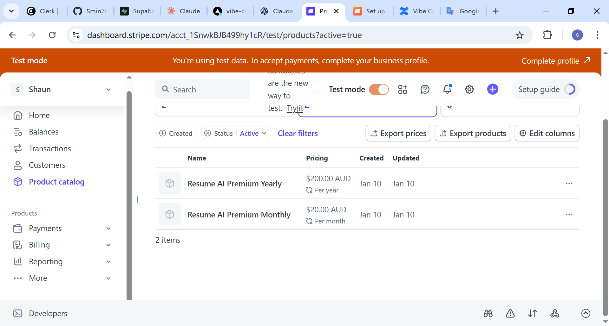
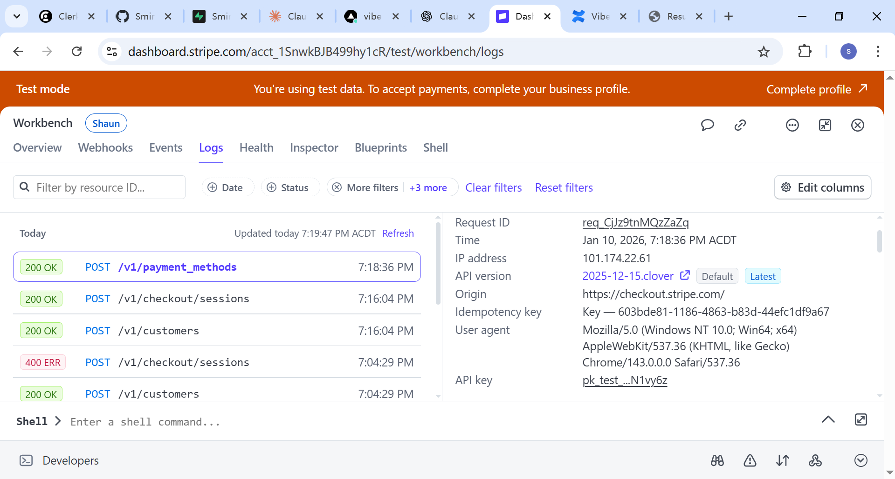
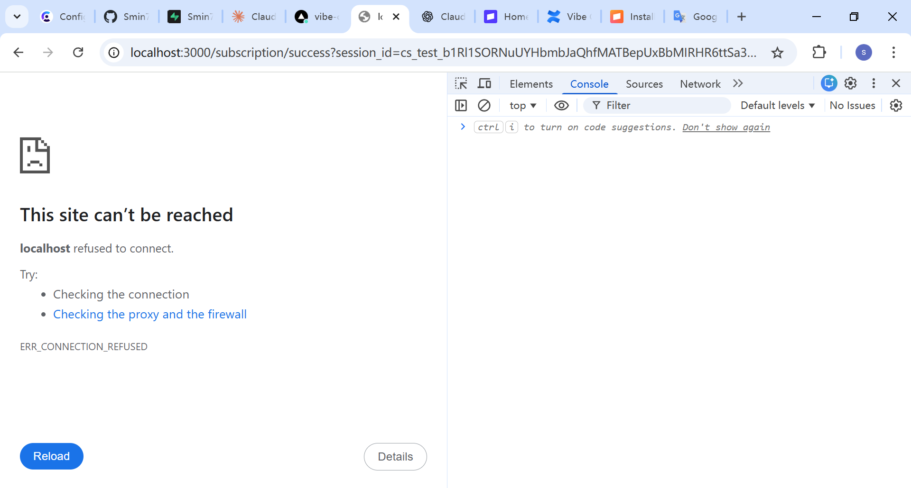

# Conversation - January 10, 2026

---

## Prompt 1

**User:** " Do not read prompts\ and docs\ folders. Read yesterday's progress below, fix the bug of stage 4.

### Stage 4: User Dashboard - Completed

**Dashboard Components Created:**

- `WelcomeHeader.tsx` - User greeting with profile completion %
- `ProfileCompletion.tsx` - Clickable checklist with progress bar
- `OnboardingGuide.tsx` - Step-by-step onboarding tracker
- `BasicInformation.tsx` - User profile + work experience display
- `ResumeInformation.tsx` - Skills tags, experience list, basic info
- `CareerAdvice.tsx` - AI-generated advice with date discrepancy warnings
- `UploadQuotaIndicator.tsx` - Quota display with upload button
- `ResumeVersionSelector.tsx` - Version dropdown (members only)
- `SubscriptionStatus.tsx` - Plan details and manage button
- `Statistics.tsx` - Resume count, skills count, experience years
- `EditWorkExperience.tsx` - Full CRUD modal for work experiences
- `BasicInfoModal.tsx` - Popup for editing profile info
- `ResumeUploadModal.tsx` - Drag-drop upload with progress and analysis

**API Endpoints Created:**

- `/api/dashboard/data` - Fetches all dashboard data
- `/api/dashboard/basic-info` - PATCH for updating profile info
- `/api/dashboard/resume` - Resume version management
- `/api/dashboard/work-experience` - Work experience CRUD

**Helper Functions:**

- `lib/dashboard.ts` - Dashboard data fetching and profile completion calculation

---

### Deployment & Configuration

- Fixed ESLint errors for Vercel deployment (apostrophe escaping)
- Provided environment variables setup guide for Vercel dashboard
- Updated all spec files: quota limit changed from 4 to 5 uploads/month

---

### Bug Fixes

| Issue                           | Solution                                |
| ------------------------------- | --------------------------------------- |
| pdf-parse webpack compatibility | Downgraded to pdf-parse@1.1.1           |
| resumeId lost on page refresh   | Added `/api/resume/current` endpoint    |
| Double JSON parsing error       | Fixed response body read once           |
| Empty Resume Information        | Added try-catch for JSON parsing        |
| Basic info update fails         | Changed `.single()` to `.maybeSingle()` |
| end_year NaN on checkbox toggle | Handle empty string → undefined         |

---

### Files Modified Summary

| File                                          | Changes                                |
| --------------------------------------------- | -------------------------------------- |
| `components/dashboard/EditWorkExperience.tsx` | Full CRUD support, manual input fields |
| `app/api/dashboard/work-experience/route.ts`  | Create + update functionality          |
| `app/dashboard/page.tsx`                      | Integrated all dashboard components    |
| `spec/*.md`                                   | Updated quota from 4 to 5 uploads      |
| `CLAUDE.md`                                   | Updated documentation                  |

---

Fetch data bug: '01:51:36.115 Error fetching dashboard data: n [Error]: Dynamic server usage: Route /api/dashboard/data couldn't be rendered statically because it used `headers`. See more info here: https://nextjs.org/docs/messages/dynamic-server-error
01:51:36.115 at c (/vercel/path0/.next/server/chunks/510.js:1:59225)
01:51:36.115 at l (/vercel/path0/.next/server/app/api/user/create-profile/route.js:1:15143)
01:51:36.115 at n (/vercel/path0/.next/server/chunks/910.js:1:6083)
01:51:36.115 at async x (/vercel/path0/.next/server/chunks/910.js:1:3409)
01:51:36.115 at async p (/vercel/path0/.next/server/app/api/dashboard/data/route.js:1:985)
01:51:36.115 at async /vercel/path0/node*modules/next/dist/compiled/next-server/app-route.runtime.prod.js:6:38411
01:51:36.115 at async e*.execute (/vercel/path0/node*modules/next/dist/compiled/next-server/app-route.runtime.prod.js:6:27880)
01:51:36.115 at async e*.handle (/vercel/path0/node*modules/next/dist/compiled/next-server/app-route.runtime.prod.js:6:39943)
01:51:36.115 at async exportAppRoute (/vercel/path0/node_modules/next/dist/export/routes/app-route.js:77:26)
01:51:36.115 at async exportPageImpl (/vercel/path0/node_modules/next/dist/export/worker.js:175:20) {
01:51:36.116 description: "Route /api/dashboard/data couldn't be rendered statically because it used `headers`. See more info here: https://nextjs.org/docs/messages/dynamic-server-error",
01:51:36.116 digest: 'DYNAMIC_SERVER_USAGE'
01:51:36.116 }
01:51:36.353 ❌ Error checking quota: n [Error]: Dynamic server usage: Route /api/quota/check couldn't be rendered statically because it used `headers`. See more info here: https://nextjs.org/docs/messages/dynamic-server-error
01:51:36.353 at c (/vercel/path0/.next/server/chunks/510.js:1:59225)
01:51:36.353 at l (/vercel/path0/.next/server/app/api/user/create-profile/route.js:1:15143)
01:51:36.353 at n (/vercel/path0/.next/server/chunks/910.js:1:6083)
01:51:36.353 at async x (/vercel/path0/.next/server/chunks/910.js:1:3409)
01:51:36.354 at async p (/vercel/path0/.next/server/app/api/quota/check/route.js:1:971)
01:51:36.354 at async /vercel/path0/node_modules/next/dist/compiled/next-server/app-route.runtime.prod.js:6:38411
01:51:36.354 at async e*.execute (/vercel/path0/node*modules/next/dist/compiled/next-server/app-route.runtime.prod.js:6:27880)
01:51:36.354 at async e*.handle (/vercel/path0/node*modules/next/dist/compiled/next-server/app-route.runtime.prod.js:6:39943)
01:51:36.354 at async exportAppRoute (/vercel/path0/node_modules/next/dist/export/routes/app-route.js:77:26)
01:51:36.354 at async exportPageImpl (/vercel/path0/node_modules/next/dist/export/worker.js:175:20) {
01:51:36.354 description: "Route /api/quota/check couldn't be rendered statically because it used `headers`. See more info here: https://nextjs.org/docs/messages/dynamic-server-error",
01:51:36.354 digest: 'DYNAMIC_SERVER_USAGE'
01:51:36.355 }
01:51:36.363 ❌ Error fetching current resume: n [Error]: Dynamic server usage: Route /api/resume/current couldn't be rendered statically because it used `headers`. See more info here: https://nextjs.org/docs/messages/dynamic-server-error
01:51:36.363 at c (/vercel/path0/.next/server/chunks/510.js:1:59225)
01:51:36.363 at l (/vercel/path0/.next/server/app/api/user/create-profile/route.js:1:15143)
01:51:36.364 at n (/vercel/path0/.next/server/chunks/910.js:1:6083)
01:51:36.364 at async x (/vercel/path0/.next/server/chunks/910.js:1:3409)
01:51:36.364 at async c (/vercel/path0/.next/server/app/api/resume/current/route.js:1:966)
01:51:36.364 at async /vercel/path0/node_modules/next/dist/compiled/next-server/app-route.runtime.prod.js:6:38411
01:51:36.364 at async e*.execute (/vercel/path0/node*modules/next/dist/compiled/next-server/app-route.runtime.prod.js:6:27880)
01:51:36.364 at async e*.handle (/vercel/path0/node_modules/next/dist/compiled/next-server/app-route.runtime.prod.js:6:39943)
01:51:36.364 at async exportAppRoute (/vercel/path0/node_modules/next/dist/export/routes/app-route.js:77:26)
01:51:36.364 at async exportPageImpl (/vercel/path0/node_modules/next/dist/export/worker.js:175:20) {
01:51:36.365 description: "Route /api/resume/current couldn't be rendered statically because it used `headers`. See more info here: https://nextjs.org/docs/messages/dynamic-server-error",
01:51:36.365 digest: 'DYNAMIC_SERVER_USAGE'
01:51:36.365 }' "

**Assistant Reply:**

- I see the issue. The API routes are failing ───────────────────────────────────────────────────────────────
  on Vercel because Next.js is trying to statically render them, but they use headers (from Clerk authentication). The fix is to add export const dynamic = 'force-dynamic' to each affected route.
  Now I'll add export const dynamic = 'force-dynamic' to all three routes to fix the static rendering issue.
  Fixed all three routes. Let me verify the build passes.

## Prompt 2

**User:** "Don't read prompts\ and docs\ folders.
Read README.md.
Read the spec\ folder.
Read CLAUDE.md.

Assume:

- Stage 1 is complete
- Stage 2 is complete
- Stage 3 is complete
- Stage 4 is complete

Implement Stage 5:

- 5.1 Stripe Setup

- 5.2 Pricing Page

- 5.3 Stripe Checkout Integration

- 5.4 Stripe Webhook Handler

- 5.5 Subscription Success/Cancel Pages

- 5.6 Stripe Customer Portal

- 5.7 Feature Gating

- 5.8 Subscription State Management

Output:

- Code changes with inline comments where necessary
- A short conclusion (≤10 bullet points)

No detailed explanations. Do not explain unless there is a breaking change. Keep responses concise."
**Assistant Reply:**

- Stage 5: User Purchase - Implementation Complete

        Files Created:

        - lib/stripe.ts - Stripe client, price IDs, webhook verification
        - lib/subscription.ts - Subscription CRUD, user type updates, history tracking
        - app/api/stripe/checkout/route.ts - Creates Stripe Checkout session
        - app/api/stripe/webhook/route.ts - Handles checkout.session.completed, subscription.updated, subscription.deleted
        - app/api/stripe/portal/route.ts - Redirects to Stripe Customer Portal
        - app/subscription/success/page.tsx - Post-payment success page
        - app/subscription/cancelled/page.tsx - Payment cancelled page

        Files Updated:

        - app/pricing/page.tsx - Added checkout buttons with Stripe integration
        - components/dashboard/SubscriptionStatus.tsx - Uses Link for navigation, portal redirect
        - components/dashboard/UploadQuotaIndicator.tsx - Uses Link for upgrade button

        ---
        Conclusion

        - Stripe client initialized with API version 2024-12-18.acacia
        - Checkout flow creates session with user metadata, redirects to Stripe
        - Webhook handler processes 4 events: checkout completed, subscription updated/deleted, payment failed
        - Customer Portal allows plan switching, cancellation, payment updates
        - Success/Cancel pages with clear messaging and navigation
        - Feature gating enforced via userType checks in dashboard components
        - Subscription state tracked in database with history logging
        - Environment variables required: STRIPE_SECRET_KEY, STRIPE_PRICE_MONTHLY, STRIPE_PRICE_YEARLY, STRIPE_WEBHOOK_SECRET
        - Middleware already protects /subscription/* routes

## Prompt 3

**User:** "give me a guide about how to create  
 STRIPE_SECRET_KEY,  
 STRIPE_PRICE_MONTHLY,  
 STRIPE_PRICE_YEARLY,  
 STRIPE_WEBHOOK_SECRET "

**Assistant Reply:**

- Stripe Setup Guide

        1. STRIPE_SECRET_KEY

        1. Go to https://dashboard.stripe.com/
        2. Click Developers → API keys
        3. Copy the Secret key (starts with sk_test_ for test mode)

        STRIPE_SECRET_KEY=sk_test_xxxxxxxxxxxxx

        ---
        2. STRIPE_PRICE_MONTHLY & STRIPE_PRICE_YEARLY

        1. Go to Products → Add product
        2. Create product: "Resume AI Premium"
        3. Add two prices:

        Monthly Price:
        - Pricing model: Standard
        - Price: $19.99
        - Billing period: Monthly
        - Copy the Price ID (starts with price_)

        Yearly Price:
        - Click "Add another price"
        - Price: $199
        - Billing period: Yearly
        - Copy the Price ID

        STRIPE_PRICE_MONTHLY=price_xxxxxxxxxxxxx
        STRIPE_PRICE_YEARLY=price_xxxxxxxxxxxxx

        ---
        3. STRIPE_WEBHOOK_SECRET

        1. Go to Developers → Webhooks
        2. Click Add endpoint
        3. Enter endpoint URL:
            - Local: https://your-ngrok-url.ngrok.io/api/stripe/webhook
            - Production: https://your-domain.com/api/stripe/webhook
        4. Select events:
            - checkout.session.completed
            - customer.subscription.updated
            - customer.subscription.deleted
            - invoice.payment_failed
        5. Click Add endpoint
        6. Click Reveal under "Signing secret"
        7. Copy the secret (starts with whsec_)

        STRIPE_WEBHOOK_SECRET=whsec_xxxxxxxxxxxxx

        ---
        Local Testing with Stripe CLI

        For local development, use https://stripe.com/docs/stripe-cli:

        # Install Stripe CLI
        # Windows: scoop install stripe
        # Mac: brew install stripe/stripe-cli/stripe

        # Login
        stripe login

        # Forward webhooks to localhost
        stripe listen --forward-to localhost:3000/api/stripe/webhook

        The CLI will output a webhook secret - use that for local testing.

        ---
        Final .env.local

        # Stripe
        NEXT_PUBLIC_STRIPE_PUBLISHABLE_KEY=pk_test_xxxxxxxxxxxxx
        STRIPE_SECRET_KEY=sk_test_xxxxxxxxxxxxx
        STRIPE_PRICE_MONTHLY=price_xxxxxxxxxxxxx
        STRIPE_PRICE_YEARLY=price_xxxxxxxxxxxxx
        STRIPE_WEBHOOK_SECRET=whsec_xxxxxxxxxxxxx

**User:** " I have update NEXT_PUBLIC_STRIPE_PUBLISHABLE_KEY=pk_test_xxxxxxxxxxxxx, STRIPE_SECRET_KEY=sk_test_xxxxxxxxxxxxx, STRIPE_WEBHOOK_SECRET=whsec_xxxxxxxxxxxxx, from Stripe Dashboard in evn.loacl file, if we are running Stripe just on test mode, do we still need to setup monthly price and yearly price on dashboard? "

**Assistant Reply:**

- Yes, you still need to create the products and prices in Stripe Dashboard even in test mode. The price IDs (price_xxx) are required for checkout to work.

              Quick Setup (Test Mode)

              1. Go to https://dashboard.stripe.com/ (ensure "Test mode" toggle is ON)
              2. Products → Add product
              3. Name: Resume AI Premium
              4. Add first price:
                  - Amount: $19.99
                  - Recurring: Monthly
                  - Click Add product
              5. Click on the product → Add another price
                  - Amount: $199
                  - Recurring: Yearly
              6. Copy both Price IDs from the product page:

              STRIPE_PRICE_MONTHLY=price_1Qxxxxxxxxxxxxx
              STRIPE_PRICE_YEARLY=price_1Qxxxxxxxxxxxxx

              ---
              Without valid price IDs, the checkout API will return an error like:
              No such price: 'price_monthly_placeholder'

              The products/prices created in test mode are separate from live mode, so you'll need to create them again when going to production.

  **User:** " I didn't complete my Stripe user profile, and the dashboard indicates I am on test mode "

  **Assistant Reply:**

  - That's fine. Test mode works without completing your Stripe profile.

            What you can do in Test Mode (no profile needed):

            - Create products and prices
            - Test checkout flow
            - Process test payments (card: 4242 4242 4242 4242)
            - Test webhooks
            - Use Customer Portal

            When you need to complete profile:

            - Only when switching to Live mode for real payments
            - Stripe will prompt you to verify identity, add bank account, etc.

            ---
            For now: Just create the products/prices in test mode and add the price IDs to your .env.local. Everything will work for development and testing.

**User:** " I canot set 2 price for 1 product, so what I did is created 2 products, check my screenshot"

**Assistant Reply:**

- That works perfectly fine. Two separate products is totally valid.

          Next Step: Get the Price IDs

          1. Click on "Resume AI Premium Monthly"
          2. In the product details, find the Price ID (starts with price_)
          3. Copy it
          4. Go back, click on "Resume AI Premium Yearly"
          5. Copy that Price ID

          The Price ID is usually shown in the pricing section of the product detail page, or click
          on the price row to see it.

          Then add to .env.local:

          STRIPE_PRICE_MONTHLY=price_xxxxxxxxxxxxxxxx
          STRIPE_PRICE_YEARLY=price_xxxxxxxxxxxxxxxx

          ---

  Note: I see you're using AUD ($20 AUD / $200 AUD). The code displays USD prices on the frontend. You may want to either:

  - Update the pricing page text to show AUD,
    or
  - Recreate prices in USD if targeting US market

**User:** "Now I have updated 2 prices ids to env.local file, update the pricing page to show AUD"

**Assistant Reply:**

- Done. Updated all prices to AUD:

        Files updated:
        - app/pricing/page.tsx - A$0, A$20/month, A$200/year
        - components/dashboard/SubscriptionStatus.tsx - A$20/month, A$200/year

        The pricing page now displays:
        - Free: A$0/month
        - Premium Monthly: A$20/month
        - Premium Yearly: A$200/year (Save A$40)

**User:** "Checkout session error: StripeInvalidRequestError: No such price: 'prod_TlUKTaYma5eSeP' {
"error": {
"code": "resource_missing",
"doc_url": "https://stripe.com/docs/error-codes/resource-missing",
"message": "No such price: 'prod_TlUKTaYma5eSeP'",
"param": "line_items[0][price]",
"request_log_url": "https://dashboard.stripe.com/acct_1SnwkBJB499hy1cR/test/workbench/logs?object=req_yebehyoe2dycwV",
"type": "invalid_request_error"
}
} I have double checked the price_id of 2 products, both correct."

**Assistant Reply:**

- The error shows you're using a Product ID (prod_TlUKTaYma5eSeP) instead of a Price ID.

        - Product ID starts with prod_ ❌
        - Price ID starts with price_ ✅

        How to get the correct Price ID:

        1. Click on "Resume AI Premium Monthly" product
        2. Scroll down to the Pricing section
        3. Click on the price row ($20.00 AUD)
        4. Look for Price ID - it starts with price_

        Example:
        # Wrong (Product ID)
        STRIPE_PRICE_MONTHLY=prod_TlUKTaYma5eSeP

        # Correct (Price ID)
        STRIPE_PRICE_MONTHLY=price_1Qxxxxxxxxxxxxxx

  The Price ID is different from the Product ID. Each product can have multiple prices, and you need the price identifier.

**User:** "I used fake bank card (4242) did  
 the test, and it is successully at Stripe, but for now the subscriptions and subscription_history tables in Supabase are still empty, how do we fix the fetch data bug?"

**Assistant Reply:**

- The issue is that Stripe webhooks can't reach localhost. Stripe sent the checkout.session.completed event, but your local server didn't receive it.

        Solution: Use Stripe CLI to forward webhooks locally

        1. Install Stripe CLI:
        Windows (with Scoop)
        scoop install stripe

        Or download from: https://stripe.com/docs/stripe-cli

        2. Login to Stripe:
        stripe login

        3. Forward webhooks to localhost:
        stripe listen --forward-to localhost:3000/api/stripe/webhook

        4. Copy the webhook signing secret (it will show in terminal):
        Ready! Your webhook signing secret is whsec_xxxxxxxxxxxxx

        5. Update .env.local with this new secret:
        STRIPE_WEBHOOK_SECRET=whsec_xxxxxxxxxxxxx  # Use the one from CLI

        6. Restart your dev server and try the payment again.

        ---
        For Vercel Deployment (Production)

        If deployed to Vercel, add your webhook endpoint in Stripe Dashboard:
        1. Developers → Webhooks → Add endpoint
        2. URL: https://your-app.vercel.app/api/stripe/webhook
        3. Select events: checkout.session.completed, customer.subscription.updated, customer.subscription.deleted

        ---

  The webhook handler will then receive events and update Supabase.

**User:** "I think I should directly do the test on Vercel, because I set the webhooks secret key from the Stripe Dashboard, not Stripe CLI. If there are no tests can be done locally, I should commit and push first, then redeploy at Vercel. "

**Assistant Reply:**

- Stage 5: Stripe Subscription Integration

  - Add lib/stripe.ts with Stripe client and price configuration
  - Add lib/subscription.ts with subscription CRUD helpers
  - Add /api/stripe/checkout for creating Checkout sessions
  - Add /api/stripe/webhook for handling Stripe events
  - Add /api/stripe/portal for Customer Portal redirect
  - Add /subscription/success and /subscription/cancelled pages
  - Update pricing page with checkout buttons (AUD pricing)
  - Update SubscriptionStatus with portal link
  - Update UploadQuotaIndicator with Link component

**User:** "I just deployed the recent commit to Vercel, after I finish the payment of Monthly subscription, it jumps to localhost, there must be error about redirection."
**Assistant Reply:**

- The NEXT_PUBLIC_APP_URL environment variable is not set in Vercel. It's defaulting to localhost:3000.
  Fix: Add Environment Variable in Vercel

        1. Go to your Vercel project → Settings → Environment Variables
        2. Add:
        NEXT_PUBLIC_APP_URL = https://your-app.vercel.app
        2. (Replace with your actual Vercel URL)
        3. Redeploy your app (or it will apply on next deployment)

        ---
        This variable is used in app/api/stripe/checkout/route.ts:

        const appUrl = process.env.NEXT_PUBLIC_APP_URL || 'http://localhost:3000';

  Without it set in Vercel, Stripe redirects to localhost after payment.

**User:** "No error in Vercel build logs, and I have finished all steps in purchase flow, but the  
 subscriptions and subscription_history tables are still empty, after payment, I need to login my  
 account again during the test, welcome member page poped up successfully, but when I got back  
 to dashboard, progress bar is still 75%, which means platform didn't detect that I just paid for subscription. I believe this is a fetch data bug."

**Assistant Reply:**

- The webhook is not reaching your Vercel app. Let's debug:

  1. Check Stripe Webhook Configuration

  Go to Stripe Dashboard → Developers → Webhooks

  Verify:

  - Endpoint URL: https://your-vercel-app.vercel.app/api/stripe/webhook
  - Events selected:
    - checkout.session.completed ✓
    - customer.subscription.updated ✓
    - customer.subscription.deleted ✓

  2. Check Webhook Logs in Stripe

  In Webhooks → click your endpoint → Logs

  Look for:

  - Are events being sent?
  - Are they succeeding (200) or failing (400/500)?

  3. Verify STRIPE_WEBHOOK_SECRET in Vercel

  The webhook secret from Stripe Dashboard (not CLI) must be in Vercel env vars:

  - Go to Vercel → Settings → Environment Variables
  - Ensure STRIPE_WEBHOOK_SECRET matches the one from Stripe Dashboard webhook endpoint (click "Reveal" under Signing secret)

  ***

  Most likely cause: Either:

  1. Webhook endpoint URL is wrong in Stripe Dashboard
  2. STRIPE_WEBHOOK_SECRET in Vercel doesn't match the Dashboard secret

  Can you check Stripe's webhook logs and tell me if the events are being sent and what response they're getting?

  **User:** "Delivery attempt
  checkout.session.completed
  Resend
  Delivery status
  Failed
  Next retry in 3 minutes
  Attempt date
  Jan 10, 2026, 9:18:40 PM
  Resent automatically
  Event ID
  evt_1SnymMJB499hy1cRB956AOwa
  Origin date
  Jan 10, 2026, 8:18:18 PM ACDT
  Source
  Automatic
  API version
  2025-12-15.clover
  Description
  A Checkout Session was completed
  Response
  HTTP status code
  401
  <!doctype html><html lang=en><meta charset=utf-8><meta name=viewport content="width=device-width,initial-scale=1"><title>Authentication Required</title><script type=text/llms.txt> ## Note to agents accessing this page: This page requires authentication to access. Automated agents should use a Vercel authentication bypass token to access this page. The easiest way to get a token is using the get_access_to_vercel_url or web_fetch_vercel_url functions of the Vercel MCP server at https://mcp.vercel.com (Docs at https://vercel.com/docs/mcp/vercel-mcp). Alternatively, this URL documents how to use the bypass token:"

**Assistant Reply:**

- The webhook is being blocked by Clerk middleware (401 Unauthorized). We need to exclude the webhook route from authentication.
  Fixed. The Stripe webhook was being blocked by Clerk middleware.

        Commit and push, then:

        1. Redeploy to Vercel
        2. In Stripe Dashboard → Webhooks → click the failed event → Resend

  The webhook should now return 200 instead of 401.
