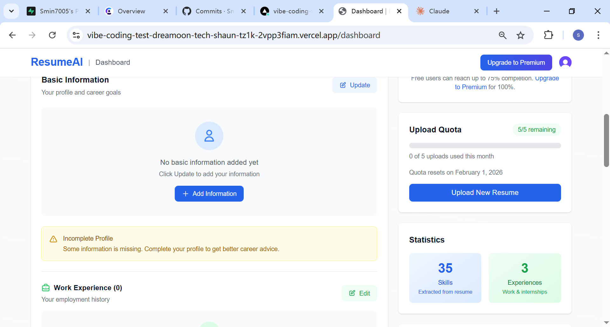

# 1. read prompts_10JAN2026.md. now there is a bug about user sign-up, after the step 2 input work experiences of onboarding flow, Vercel log reports 404, it cannot jump to step 3 Resume uploading.

**Reply:**

- Found it! The /api/onboarding/progress route is missing export const dynamic = 'force-dynamic' which is required for routes that use Clerk's auth() on Vercel. Let me fix this.Bug Fixed!

        The issue was that the /api/onboarding/progress route was missing export const dynamic = 'force-dynamic'.

        Root Cause:
        - The route uses Clerk's auth() which requires HTTP headers
        - Without force-dynamic, Next.js attempts to statically render the route on Vercel
        - This fails and returns 404 when the API is called during onboarding

        Fix Applied:
        - File: app/api/onboarding/progress/route.ts
        - Added: export const dynamic = 'force-dynamic'

        Same issue was previously fixed for:
        - /api/dashboard/data
        - /api/quota/check
        - /api/resume/current

        Next Steps:
        1. Commit and push:
        git add . && git commit -m "Fix: Add force-dynamic to onboarding progress API route" && git push
        2. Redeploy on Vercel
        3. Test the sign-up flow again - step 2 → step 3 should now work

# 2. Warning: NODE_ENV was incorrectly set to "development", this value is being overridden to "production" I ran tests agin and still cannot proceed to step 3 onboarding flow. Vercel log reports 404 on both GET and POST requests.

**Reply:**

- Build passed.

  Root Cause:
  The 404 was caused by a race condition:

  1. User completes Clerk sign-up
  2. Clerk redirects to /onboarding immediately
  3. /api/onboarding/progress is called before Clerk webhook creates user profile in Supabase
  4. API returns 404 "User profile not found"

  Fix Applied:
  Added getOrCreateUserProfile() helper function in app/api/onboarding/progress/route.ts that:

  - First tries to get existing profile from Supabase
  - If not found, creates it using currentUser() from Clerk
  - Handles race condition if webhook creates profile simultaneously (catches unique_violation error)
  - Initializes onboarding progress after creating profile

  Changes:

  - File: app/api/onboarding/progress/route.ts
  - Added import: currentUser from @clerk/nextjs/server
  - Added: getOrCreateUserProfile() helper function
  - Updated: Both GET and POST handlers to use the helper

  Next Steps:
  git add . && git commit -m "Fix: Handle race condition in onboarding - create user profile if webhook hasn't fired yet" && git push

  Then redeploy to Vercel and test the sign-up flow again.

3.  The 404 on both GET and POST indicates the user profile doesn't exist in Supabase when the onboarding page loads. This means the Clerk webhook to create profiles isn't completing before the user lands on /onboarding. The issue is a race condition: Clerk redirects to /onboarding before the webhook creates the user profile.

Let me fix the /api/onboarding/progress route
Build passed.

Root Cause:
The 404 was caused by a race condition:

1. User completes Clerk sign-up
2. Clerk redirects to /onboarding immediately
3. /api/onboarding/progress is called before Clerk webhook creates user profile in Supabase
4. API returns 404 "User profile not found"

Fix Applied:
Added getOrCreateUserProfile() helper function in app/api/onboarding/progress/route.ts that:

- First tries to get existing profile from Supabase
- If not found, creates it using currentUser() from Clerk
- Handles race condition if webhook creates
  profile simultaneously (catches unique_violation error)
- Initializes onboarding progress after creating profile

Changes:

- File: app/api/onboarding/progress/route.ts - Added import: currentUser from @clerk/nextjs/server
- Added: getOrCreateUserProfile() helper function
- Updated: Both GET and POST handlers to use the helper

Next Steps:
git add . && git commit -m "Fix: Handle race condition in onboarding - create user profile if webhook hasn't fired yet" && git push

Then redeploy to Vercel and test the sign-up flow again.

# 3. New bugs, now after onboarding flow finished, the basic information and work experience components are still emptym, also, upload quota should be 1 out of 5, because I already uploaded 1st resume during sign-up onboarding flow.

**Reply:**

- I see the APIs exist. The issue is the onboarding page doesn't call them. Let me update the onboarding page to save data when forms are submitted. I need to update the handlers to actually save data to the database. Let me modify handleBasicInfoSubmit and handleWorkExperienceSubmit.

        Bug 2: Basic info and work experiences empty on dashboard

        Root Cause: Onboarding forms only stored data in React state, never saved to database

        Fix: Updated app/onboarding/page.tsx:
        - handleBasicInfoSubmit now calls PATCH /api/dashboard/basic-info
        - handleWorkExperienceSubmit now calls PATCH /api/dashboard/work-experience

        Bug 3: Missing force-dynamic on API routes

        Root Cause: Routes using auth() failed on Vercel without dynamic rendering

        Files Fixed:
        - app/api/onboarding/progress/route.ts
        - app/api/dashboard/basic-info/route.ts
        - app/api/dashboard/work-experience/route.ts
        - app/api/dashboard/resume/route.ts
        - app/api/resume/upload/route.ts
        - app/api/resume/analyze/route.ts
        - app/api/quota/increment/route.ts
        - app/api/user/update-type/route.ts

        Next Steps:
        git add . && git commit -m "Fix: Onboarding data persistence and API dynamic rendering

        - Add getOrCreateUserProfile to handle webhook race condition
        - Save basic info and work experiences to database during onboarding
        - Add force-dynamic export to all API routes using Clerk auth

        Co-Authored-By: Claude Opus 4.5 <noreply@anthropic.com>" && git push

        Then redeploy to Vercel and test the full sign-up → onboarding → dashboard flow.

# 4. Now there is 1 bug left, as free user, after finishing the sign-up onboarding flow, the upload quota should be 1 out of 5, not 0 out of 5.

**Reply:**

- Build passed.

        Bug Fixed: Upload quota showing 0/5 instead of 1/5

        Root Cause:
        During onboarding, the user's user_type is 'guest'. The quota check and increment logic only ran for 'free' users. So when a guest uploads a resume during onboarding, the quota wasn't tracked.

        Fix Applied:
        Updated app/api/resume/upload/route.ts:

        - Line 59: Quota check now includes guest users
        - Line 126: Quota increment now includes guest users

        // Before
        if (userProfile.user_type === 'free') {

        // After
        if (userProfile.user_type === 'free' || userProfile.user_type === 'guest') {

        Next Steps:
        git add . && git commit -m "Fix: Track upload quota for guest users during onboarding

        Co-Authored-By: Claude Opus 4.5 <noreply@anthropic.com>" && git push

  Then redeploy to Vercel. After the fix, when a guest user uploads a resume during onboarding and becomes a free user, their dashboard will correctly show "1 out of 5" uploads used.
